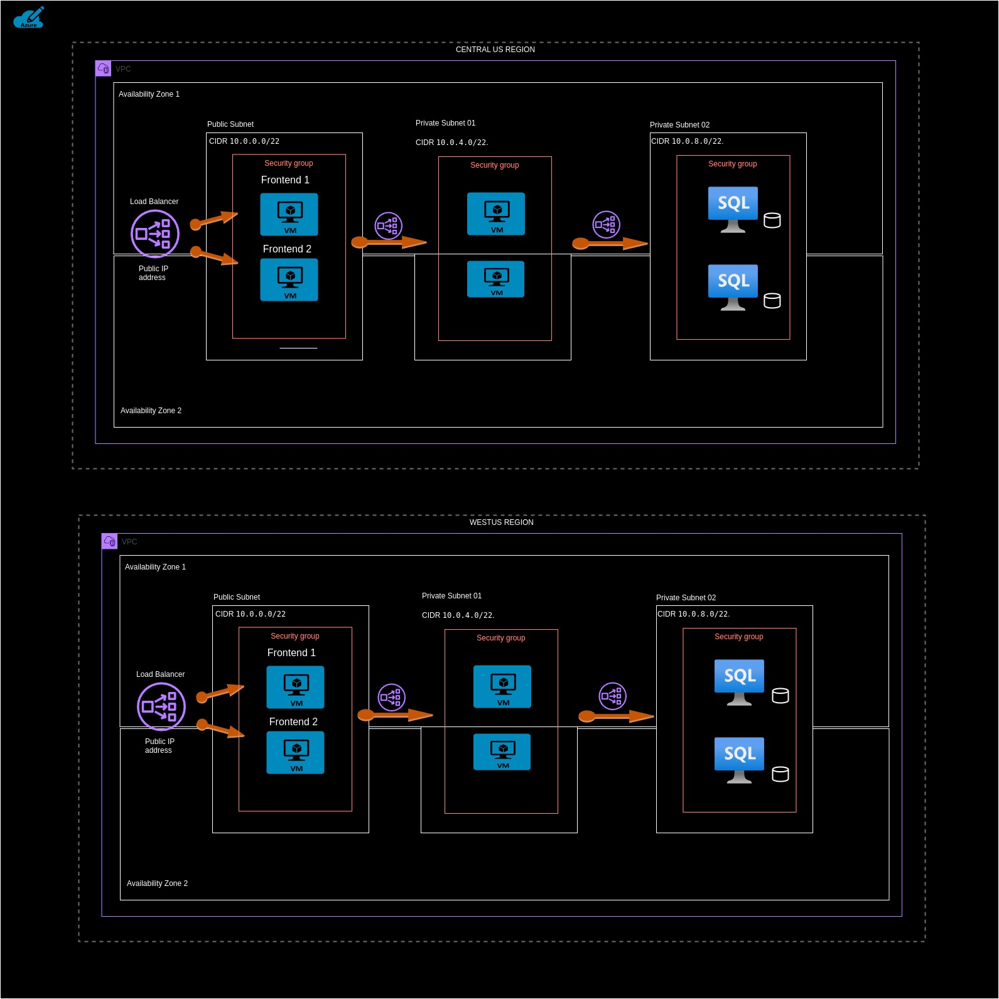
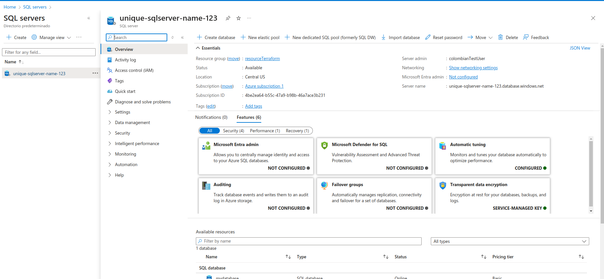

# Azure Multi-Tier Infrastructure Deployment with Terraform

## Project Overview

This project focuses on the deployment of a scalable and secure multi-tier infrastructure on Microsoft Azure, designed to support a web application. The infrastructure is provisioned using Terraform, ensuring consistent, reproducible, and maintainable deployments.

In addition to the core infrastructure setup, this project incorporates advanced high availability and multi-region strategies to enhance resilience and performance.

## High Availability (HA):

Frontend Tier: The frontend infrastructure uses Azure Virtual Machines deployed across multiple Availability Zones (AZs) within a single region. This setup ensures that the application remains operational even if an entire AZ experiences a failure. Auto-scaling is configured to dynamically adjust the number of instances based on CPU utilization, ensuring optimal performance and cost efficiency.

Backend Tier: The backend infrastructure is similarly distributed across multiple AZs, with a focus on high availability and load balancing. Virtual Machines are created in a similar multi-AZ configuration, and Azure Load Balancer is used to distribute traffic across instances, providing redundancy and failover capabilities.

## Multi-Region Deployment:

Frontend Deployment: To further enhance availability, the frontend is deployed in multiple regions. This strategy allows the application to withstand regional outages and provides a better user experience by reducing latency for users in different geographical locations.

Backend Deployment: The backend services are also distributed across multiple regions. This multi-region approach not only improves fault tolerance but also ensures that backend services can continue operating if one region encounters issues.

## Subnet Configuration for Databases:

The database infrastructure is placed in a dedicated subnet, isolated from frontend and backend traffic. High availability and disaster recovery strategies are applied at the database level, including geo-replication to keep data synchronized across regions and automated backups to safeguard against data loss.
By leveraging these advanced configurations, the project ensures a robust and resilient infrastructure capable of handling both expected and unexpected failures while maintaining optimal performance across diverse geographic locations.

## Infrastructure Components Diagram



### 1. Virtual Network (VNet) and Subnets

- **VNet**: A Virtual Network named `main-vpc` with an address space of `10.0.0.0/16`.
- **Subnets**:
  - `public-subnet` (10.0.0.0/22): Hosts frontend virtual machines (VMs) and is exposed to the internet via a public load balancer.
  - `private-subnet-1` (10.0.4.0/22): Hosts backend VMs, accessible only from the frontend subnet.
  - `private-subnet-2` (10.0.8.0/22): Hosts the SQL Server, accessible only from the backend subnet.

### 2. Frontend Layer

- **Virtual Machines**: Two Windows Server VMs are deployed in the `public-subnet` to serve as the frontend for the application.
- **Load Balancer**: A public Azure Load Balancer distributes incoming traffic on port 8080 to the frontend VMs.
- **Network Security Group (NSG)**: 
  - NSG named `frontend_sg` allows inbound traffic on port 8080 from the internet.

### 3. Backend Layer

- **Virtual Machine**: A Windows Server VM is deployed in `private-subnet-1` to handle application logic and processing.
- **Access Control**: 
  - The backend VM is accessible only from the frontend VMs via port 6000.
  - The backend VM connects outbound to the SQL Server on port 3306.
- **Network Security Group (NSG)**: 
  - NSG named `backend_sg` enforces access rules.

### 4. Database Layer

- **SQL Server**: An Azure SQL Server is deployed in `private-subnet-2` for data storage.
- **SQL Database**: A database is created on the server, configured with the S0 SKU and zone redundancy.
- **Access Control**: 
  - The SQL Server is accessible only from the backend VM on port 1433.
- **Network Security Group (NSG)**: 
  - NSG named `sql_sg` ensures only traffic from `private-subnet-1` can access the SQL Server.

### 5. Security and Networking

- **Network Security Groups (NSGs)**: 
  - Protect all VMs and the SQL Server, ensuring strict traffic control.
- **Subnet-to-Subnet Communication**: 
  - Managed via internal Azure routing and NSG rules.
- **Public Access Restriction**: 
  - Only the load balancer is exposed to the internet, shielding the backend and database layers from direct internet exposure.

### 6. State Management

- **Terraform State**: 
  - Managed using an Azure Storage Account to enable collaborative infrastructure management.
  - The state is stored in a storage container named `tfstate` in the `terrstorageacc` Storage Account within the `Terraform Resource Group`.


### 7. Multi-Region Architecture

- **Primary Region**: The main infrastructure is deployed in the `Central US` region. This includes the primary Virtual Network (`main-vpc`), subnets, and compute resources (frontend, backend, and database).
- **Secondary Region**: A replica of the critical components (backend, database) is deployed in the `North Central US` region. This region serves as a failover location in case of a catastrophic failure in the primary region.

### 8. High Availability (HA)

- **Availability Zones**: Within each region, critical resources are distributed across multiple Availability Zones. This ensures that if one zone experiences a failure, the resources in other zones remain unaffected.
  - **Frontend**: VMs are deployed in multiple zones within the region.
  - **Backend**: Similarly, backend VMs are distributed across different zones.
  - **SQL Database**: The SQL database is configured with `zone_redundant = true`, ensuring it is replicated across multiple zones within the same region.

### 9. Load Balancing and Auto-Scaling

- **Public Load Balancer**: The frontend VMs are behind a public Azure Load Balancer, which distributes incoming traffic across the VMs. The Load Balancer is configured to support multiple Availability Zones, enhancing the overall availability.
- **Internal Load Balancer**: Backend VMs are behind an internal Azure Load Balancer, ensuring load distribution for internal traffic within the VNet.
- **Auto-Scaling**: Auto-scaling is configured for both frontend and backend tiers. Based on CPU utilization, additional VMs are automatically spun up to handle increased load, and similarly, they are scaled down when the load decreases.

### 10. Failover and Disaster Recovery

In the event of a failure in the primary region:

- **Traffic Manager**: Azure Traffic Manager or Azure Front Door can be configured to route traffic to the secondary region automatically. This ensures that the application remains available even if the primary region becomes unavailable.
- **Database Replication**: The SQL Server in the secondary region is set up as a replica of the primary database using Azure SQL Geo-Replication. This ensures data consistency and availability across regions.


## Getting Started

### Prerequisites

- [Terraform](https://www.terraform.io/downloads.html) installed on your local machine.
- An active [Azure subscription](https://azure.microsoft.com/).

### Installation

1. **Clone the Repository**:
    ```bash
    git clone <repository-url>
    cd <repository-directory>
    ```

2. **Initialize Terraform**:
    ```bash
    terraform init
    ```

3. **Review and Modify Configuration**:
    - Adjust the variables in the `terraform.tfvars` file to match your environment.

4. **Plan the Deployment**:
    ```bash
    terraform plan
    ```

5. **Apply the Deployment**:
    ```bash
    terraform apply
    ```

### Cleanup

To destroy the infrastructure when no longer needed:

bash
terraform destroy

### Key Benefits

## Scalability: 
The infrastructure is designed to scale easily by adding more VMs to the frontend or backend tiers, with the load balancer handling traffic distribution.

## Security: 
By segmenting the infrastructure into public and private subnets, and applying stringent NSG rules, the design ensures that sensitive components are protected from unauthorized access.

## Resilience: 
The use of zone-redundant databases and isolated backend processing ensures the application remains resilient to failures and maintains availability.

## Automation and Consistency: 
Terraform provides automated and consistent infrastructure deployment, reducing the risk of manual errors and ensuring repeatable environments.

### Conclusion
This project provides a robust foundation for deploying, managing, and scaling a secure web application in Azure, adhering to industry best practices for cloud infrastructure.

For further details on usage and customization, please refer to the Terraform files provided in this repository.


### Cost estimation:
This proposal outlines the estimated costs for a web service hosted on Microsoft Azure, based on pricing information obtained directly from Azure's official website. The prices are calculated for one month of usage, and they could be reduced by implementing cost-saving strategies. Two effective methods for obtaining discounts include purchasing Reserved Instances, which offer significant savings when committing to one- or three-year terms, and leveraging Azure's Spot Virtual Machines, which provide lower prices for unused capacity, ideal for workloads that can tolerate interruptions.


### Deployment Screenshots:
I will attach screenshots of the resources deployed on Azure to demonstrate how the code successfully executes tasks in the cloud. These images will provide visual confirmation of the deployment and operation of the web service.

## Virtual Machines: 


## VPC and Subnets: 


## Load Balancers: 


## Storage Account: 


## Security Groups: 
# DataBase Security Group


# FrontEnd Security Group


# BackEnd Security Group


## SQL Server



## SQL Database
